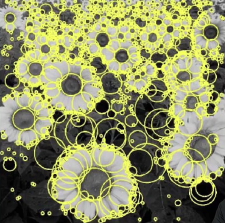

# Blob

## What is Blob detection?

주변보다 더 밝거나 어두운 부분의 image regions

procedure

1. image smoothing
2. the Laplacian of Gaussian 이나 the difference of Gaussian 을 적용
3. optimal scale 과 orientation parameters를 찾음

## Edge detection , Blob detection 의 차

## Laplace operator

두개의 grad 벡터를 inner product

## Laplace of Gaussian

여기서 isotropic 은 mean=zero 이고, x와 y의 방향성에 스케일이 없는것입니다.

이때 Laplacian of isotropic Gaussian distribution을 전개하면 기존의 Gaussian의 값을 건드리지 않고

앞의 x,y, sigma 값의 변형만으로 표현할 수 있습니다.

## Laplacian of Gaussian filter

이 Gaussian filter 또한 edge와 같이 window 단위로 옮겨가며 detecting을 하게 됩니다.

이때 Laplacian 의 scale을 탐색해야합니다.

여러가지 scale에서 magnitude(중요도)가 가장 커지는 값을 탐색합니다.

## best scale sclection

보통  $\sigma = \frac{r}{\sqrt{2}}$ 일때 가장 좋은 scale 이라고 알려져있습니다. 

## scale normalization

하지만 위의 방법으로 best scale 을 탐색했더라도 신호의 값이 너무 작아질수도 있습니다.

$\sigma^2$ 을 곱하여 normalize 해줍니다.

