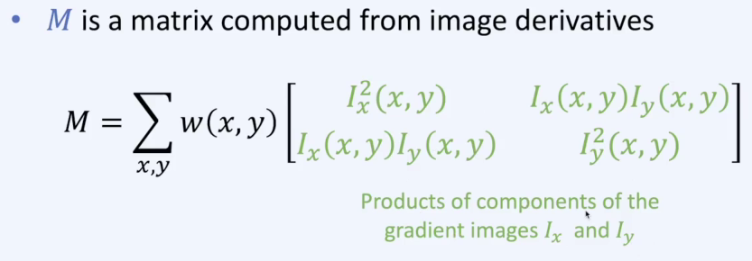

# md_img/edge_and_corner

# Edge Detection

NMS를 통해 blur 한 부분들을 제거하고 edge로 변환

# Corner

코너점이 중요한 이유는 이미지에서 가장 중요한 구조 정보를 담고 있기 때문입니다

# Harris Corner Detection

Corner를 찾는 고전적이지만 요즘에도 자주 사용하는 알고리즘

대체적으로 Gaussian weights를 사용하여 노이즈에 robust 하게 만듭니다.

계산 과정입니다.

