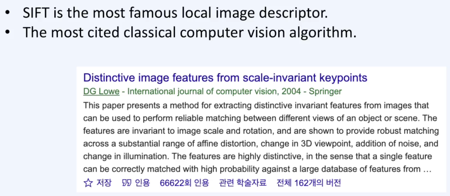
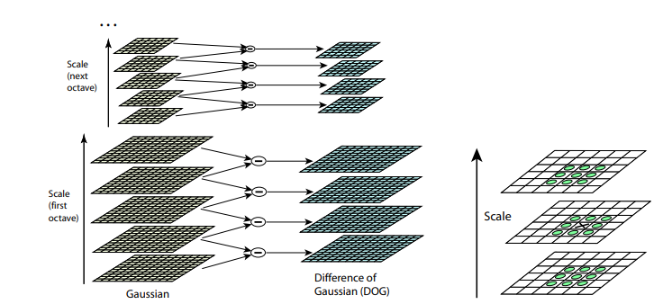
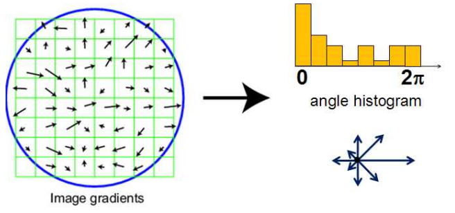

# SIFT

Scale-Invariant Feature Transform

66000회가 넘는 인용수…

## Revisted : Feature Points

주변 all neighboring points 에서 가장 다른 부분을 찾음

## SIFT - Keypoint detector & descriptor

1. Detector는 Blob detection 이나 harris corner와 같이 scale-space 에서 값이 아주 높은 값을 찾습니다.
2. NMS 와 같은 방법으로 Threadholding 을 통해 filtering 을 해줍니다.
3. 4X4 Gird 에 Orientation 을 가진 히스토그램으로 만듭니다.
4. Dominant Orientation 의 방향으로 정규화 한후 descriptor를 계산

## SIFT 의 장점

1. Scale Variation - Scale이 달라지는 것에 robust 합니다.
2. Illumination change - grad값으로 계산을 하기 때문에 Illuminaion change 에 robust 합니다.
3. Rotation - Dominant Orientation을 사용하여 normalize 를 했기 때문에 Rotation에도 robust합니다.
4. Viewpoint change - 시점의 변화에도 robust함을 가집니다.

## SIFT 1. Find Scale-Space Extrema

기존의 방법은 LoG(Laplacian of Gaussian)을 통해 Blob을 찾았습니다.

하지만 SIFT에서는 DoG(Difference of Gaussian) 을 사용합니다.

왼쪽, 초록 가우시안 그래프에서 빨간색 가우시안 그래프를 빼게되면 파란색 그래프가 나오게 됩니다.

이렇게 만들어진 그래프를 DoG 라고 합니다. 이때 DoG는 (Scale normalized) LoG와 상당히 비슷한것을 볼 수 있습니다. 

 

이 내부의 계산과정을 보면

이때 위의 $\frac{x^2+y^2-2\sigma^2}{\sigma^3}$의 값이 LoG의 값과 비슷한 것을 볼 수 있습니다.

즉 DoG가 Scale-normalized LoG를 거의 근사한다고 볼 수 있습니다.

Gussian-blur를 pyramid scale로 적용을 한 이미지에서 level별 차이를 추출합니다(DoG)

그리고 DoG의 3x3x3 을 확인하여 가장 extrema로 keypoint를 찾습니다.

## SIFT 2. Keypoint Filtering

이렇게 찾은 Keypoint들에서 Threadhold를 넘지 못하는 것을 제거합니다.

특히 한방향으로 edge response 가 너무 큰 edge에 대해 서 제거를 합니다.

Hassian matrix에서 keypoint 에 대한 위치와 scale의 의 고유값을 찾습니다.

그리고 고윳값 분해(eigende composition)와 $\lambda_1$을 $\lambda_2$의 scale($\gamma$) 한 값이라고 보고 계산을 합니다.

이때 $\frac{(\gamma+1)^2}{\gamma}$ 의 값이 Threadhold 를 넘는값만 표현을 해줍니다.

## SIFT 3. Orientation Assignment

이때 Keypoint 주변 gradient의 magnitude(크기)와 orientation(방향) 을  계산해줍니다.

이렇게 계산된

grad의 벡터(크기와 방향)들을 통합하여 방향성의 값을 histogram으로 voting 합니다.

그리고 Dominant orientation을 선정합니다. 이때 histogram에 pick값의 80%가 넘는 두번째 값이 있다면 새로운 keypoint로 선정하고 Dominant orientation을 2개 만들어 냅니다.

## SIFT - Calculating Descriptor

Angle histogram 에서  Dominatnt orientation 를 기준으로 회전합니다.

그리고 Unit 의 길이 단위로 Normalize 합니다.

그런뒤 각각의 histogram에 각 방향성 값을 펼쳐서 기입합니다. 

위 과정을 정리하면

많은 Key point를 찾고 Filtering 으로 거른다음 keypoint 주변의 patch들에서 pixel들을 보고 Orientation map을 보게 됩니다.

각 값들을 voting을 통해 angle histogram을 생성한다음  Dominant orientation기준으로 회전, Unit length기준으로 크기 정규화를 해줍니다.

마지막으로 128 (8*16) dims 의 histogram을 생성합니다.

## SIFT - Summary

**Scale invariance** - Gaussian pyramid image 로 scale-space search 했기 때문에 Scale 에 robust

**Rotation invariance** - dominant orientation 의 방향으로 회전하여 rotation 에 robust 합니다.

**illumination change** - gardiant-based descriptor 이기 때문에 조도에 robust 합니다.

**noise** - image pyramid 를 만들때 Gaussian smoothing 을 진행했기 때문 noise에 robust하다 할수있습니다.

## Matching with SIFT

- rotation, scale change

- illumination, scale  change

