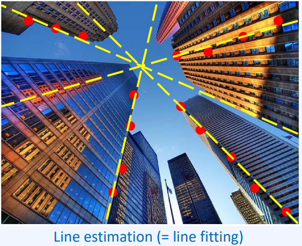

# model_fitting

## Fitting problem

1. 소실점 찾기

이미지 상에서 소실점을 찾을 line을 그어 교차점을 찾아야 할 때. 선 방정식을 어떻게 찾을 것인지 알아야합니다.

1. 이미지 붙이기

여러장의 이미지를 붙일때 이미지 사이 homograhphic transformation을 추정할 때 model fitting으로 찾게 됩니다.

1. 3D object recognition

3d object 에서 각 다른 local feature 에서 data 를 모아 graph형태의 representation으로 하나의 차라는 것을 인식하기

 

### goal

data에 적합한 parametric model을 찾는것

### Techniques

위와 같은 Task를 진행하는 Techniques 로는 아래와 같은 방법이 있습니다.

1. Least square methods
2. RANSAC
3. Hough transform

### challenges

이러한 것을 추정하는데 해결해 나가야 할 점들이 있습니다.

1. noise data
2. outliers
3. Missing data

## Least square methods

### Linear least square

square error 를 가장 줄이는 $y=ax+b$  를 찾는 것이 목표입니다.

 

각 점에 대한 $y=ax+b$ 를 $ax+b-y$ 로 바꿔줍니다.

그리고 square summation으로 각 점에서의 거리의 합을 최소화하는 a,b를 찾습니다.

이때 위 식의 grad = 0 인 부분이 최소값인 것을 이용합니다.

### Weighted Linear least square

하지만 여기서 각 점, 각 데이터에대해 더 중요도(weight)를 넣어줄 수 있습니다.

### Least square methods 의 한계점

- 데이터의 분포가 수직 또는 수평 에 가까울수록 Least square error가 커지는 현상
    - 축의 방향으로 계산을 했기 때문
    - 회귀 선의 수직한 방향으로 하는것이 좋

위의 한계점에서 나온것이

### Total Linear Least Square

선분에 수직한 distance 에서 각 점에서의 거리를 최소

Objective function 에서 $a$(a,b,c) 를 찾는 것입니다.

따라서 가장 작은 eigan value 가 곱해진 a 가 최적의 a ($a^*$) 임을 알 수 있습니다.

### Least square 의 한계점

거리의 제곱을 하다보니 outliers 에 robust 하지 못합니다.

조금의 outlier에도 최적의 값에서 크게 벌어지게 됩니다.

## RANSEC

RANSEC은 Random Sample Consensus 의 줄임말입니다.

### RANSEC의 특징

1. huge outliers 에도 사용가능
2. model estimation time 도 줄이는데 효과적
3. Iterative 알고리즘으로 가정과 test를 반복하여 fitting 합니다.

### example of RANSEC Line fitting

1. 랜덤한 두점을 고릅니다.

1. 선분을 그립니다.

1. 선분에 수직한 Error의 길이를 계산합니다.

1. 선분에서 일정 범위내에 몇개의 점이 있는지 세고 총 개수에서 비율을 구합니다.

1. 위 과정을 반복하면서 best model을 추정합니다.

이 과정에서 가장 높은 값을 기억하면서 계속해서 탐색을 합니다. 지정한 n번이 끝나면 종료하고 best를 선정합니다.

 

위 과정들을 정리하면

1. N 번 반복하는 과정에서 s개의 point 를 선택하여 line fitting 을 합니다.
2. 그 라인의 t범위에 point가 몇개 있는지 확인하고 d 개 이상이면 후보군에 넣습니다.

이때 N, s, t, d 하이퍼 파라미터를 정해야 합니다.